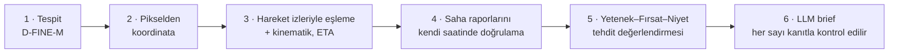

# ROKETSAN Level Up AI Hackathon — Takım Deposu

Bu depo hackathonun iki aşamasının kodunu tutar.

| Aşama | Klasör | İçerik |
|---|---|---|
| **Aşama 1** | [`asama-1/`](asama-1/) | Kaggle yarışması: drone görüntülerinde araç tespiti (car · truck · van · bus). D-FINE-M (DEIM) eğitim ve çıkarım kodu: `train.py`, `predict_submission.py`, `predict_tiled.py`, `eval_map50.py`, `configs/`. Kontrol noktası (AP50 0,712, ~300 MB) git'e girmez. Bu model Aşama 2'de tespit adımıdır. |
| **Aşama 2** | [`asama-2/`](asama-2/) | **DİZDAR** — saha raporu destekli üs risk ajanı: drone karelerini, hareket izlerini ve saha raporlarını birleştirip operatöre kareleri risk sırasıyla, kanıta bağlı Türkçe brief'lerle sunar. |

## Aşama 2 — DİZDAR, tek bakışta

Bir askerî üssü çevreleyen 8 bölgeden gelen 40 drone karesi, 226 hareket izi ve 137 saha raporu. Her kare için:



1–5 deterministik Python'dur; LLM hesap yapmaz, yalnızca yazar ve yazdığı her sayı kanıtla karşılaştırılır. Operatör web arayüzünde kareleri risk sırasıyla görür, kararını verir, sohbet panelinden kayıtları sorgular.

**Ayrıntılı belge (problem, mimari, risk modeli, kurulum, demo):** [`asama-2/README.md`](asama-2/README.md)

Hızlı başlangıç (resmî veri paketi, model ağırlıkları ve `.env` ekipten alınır; ayrıntı Aşama 2 belgesinde):

```bash
cd asama-2/dizdar
cp .env.example .env
docker compose up --build -d        # arayüz: http://127.0.0.1:8000
```

## Depo yapısı

```
README.md               bu dosya
AGENTS.md  CLAUDE.md    kod asistanları ve geliştiriciler için Aşama 2 kuralları ve kurulum
asama-1/                Aşama 1: D-FINE-M eğitim/çıkarım kodu (engine/, configs/, train.py, predict_*.py)
asama-2/                Aşama 2: DİZDAR
  README.md             Aşama 2 belgesi
  PROJECT_DESIGN.md     ürün ve tasarım gerekçeleri
  STAGE2_ARCHITECTURE.md  modül ayrıntıları
  dizdar/               uygulama (Python + React)
```

Git'e girmeyenler: model ağırlıkları (`*.pth`), resmî veri paketi (`asama-2/data/`), Kaggle verisi, organizatör belgeleri (PDF/PPTX), `.env`.
