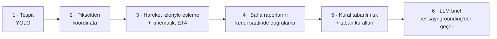

# NÖBETÇİ — Saha raporu destekli üs risk ajanı

ROKETSAN Level Up AI Hackathon, Aşama 2. Bir askerî üssü çevreleyen 8 bölgeden gelen drone karelerini **risk sırasına dizer**, her kare için kanıta dayalı bir değerlendirme üretir ve harekât merkezindeki nöbetçi operatöre "önce nereye bakmalıyım, neden?" sorusunun cevabını verir.

Her kare için 6 adım çalışır. İlk 5 adım deterministik Python'dur; LLM hesap yapmaz, yalnızca yazar ve yazdığı her sayı kanıtla kontrol edilir (grounding).



> Resmî veri paketi, Kaggle ekibinin tespit modeli ve hackathon GLM anahtarı henüz gelmedi. Sistem şu an dev verisi (40 kare, 226 hareket izi, 137 rapor), geçici YOLO modeli (COCO yolov8n) ve Evren üzerindeki `glm-5.3` ile çalışıyor.

> **Bu `main` dalı.** Güncel kod ve belgeler henüz birleştirilmedi; çalışmaya **`ui-redesign`** dalından başla (bkz. [Dallar](#dallar-branchler)). Bu sayfadaki belge bağlantıları o dala gider.

---

## Dallar (branch'ler)

| Dal | İçerik | Ne zaman kullanılır |
|---|---|---|
| **`ui-redesign`** | `calibration-demo`'nun tamamı + profesyonel arayüz: Astro UXDS renkleri, taktik ekran düzeni (uyarılar · harita · önizleme), durum çubuğu, haritada tahmini varış, 2525'ten esinlenen semboller, ≥ 6:1 kontrast testi | **En güncel kod. Yeni başlıyorsan bunu kullan.** |
| `calibration-demo` | Kalibrasyon ve kör etiketleme, demo senaryosu, kronometre, UX turu (aha kartı, ETA'lı kuyruk, karar akışı, amir ekranları, etki sayfası, vardiya oynatma, erişilebilirlik) | Demo ve kalibrasyon işlerinin tabanı |
| `main` | İlk çalışan sürüm + `AGENTS.md` | Kararlı referans; yukarıdaki iki dal henüz birleştirilmedi |

Dallar birbirinin devamıdır: `main` → `calibration-demo` → `ui-redesign`. Birleştirme (`main`'e merge) kararını teknik lider verir.

**Yeni bir işe başlarken:**

```bash
git fetch origin
git switch ui-redesign && git pull
git switch -c <kisa-is-adi>        # ör. kaggle-model, analyst-v3
```

Birleştirmeden önce `make check`, `make ui-test` ve `make demo-check` yeşil olmalı (bkz. [Kontroller](#kontroller)).

---

## Hızlı kurulum (≈ 5 dk)

Tüm komutlar `ROKETSAN HACKATHON/stage2` içinden çalışır. **Klasör adında boşluk var**; yolu her zaman tırnakla yaz.

```bash
git clone https://github.com/BeratAltunn/sungur.git
cd sungur && git switch ui-redesign
cd "ROKETSAN HACKATHON/stage2"
cp .env.example .env               # LLM anahtarını ekle (aşağıda); boş kalırsa sistem şablon brief ile çalışır
```

### Yol A — Docker (önerilen: ekip ve yedek laptop)

Gereken: Docker Desktop (Compose v2.24+).

```bash
docker compose up --build -d       # ilk derleme birkaç dakika (~2,6 GB imaj)
```

Arayüz: http://127.0.0.1:8000 · loglar: `docker compose logs -f` · durdurma: `docker compose down`

### Yol B — Doğrudan makinede (geliştirme için daha hızlı)

Gereken: Python 3.12, Node 20+ (22/24 test edildi), npm.

```bash
python3 -m venv .venv && source .venv/bin/activate
make install                       # Python paketleri + YOLO ağırlıkları (models/yolov8n.pt)
make check                         # ruff + testler
make app                           # arayüzü derler, API + arayüz: http://127.0.0.1:8000
```

Arayüz üzerinde çalışırken bir terminalde `make app` açık kalsın, diğerinde `make dev-web` (http://127.0.0.1:5173, anlık yenileme). Docker açıksa önce `docker compose down` (port 8000 çakışır).

### LLM anahtarı (Evren, `glm-5.3`)

**Her ekip üyesi kendi anahtarını kullanır**; Evren kullanım şartları paylaşımı yasaklıyor. Anahtar yalnızca `stage2/.env` içinde durur, commit edilmez.

1. Evren portalında `/api-keys` sayfasından `evren_llm_…` anahtarı üret.
2. `.env` içinde yalnızca `GLM_API_KEY=` satırını doldur; diğer satırlar hazır.
3. Hesap başına bir kez kullanım şartlarını kabul et (kabul edilmezse her istek `403 terms_not_accepted` döner). Komutlar: [`AGENTS.md` §4](https://github.com/BeratAltunn/sungur/blob/ui-redesign/AGENTS.md#4-llm-evren-platformunu-bağlama).

Anahtar olmadan da her şey çalışır: brief'ler kural tabanlı şablondan gelir, demo kareleri LLM önbelleğinden (`cache/llm/`) açılır.

### Çalıştığını doğrula

| Komut | Beklenen |
|---|---|
| `curl -s http://127.0.0.1:8000/api/health` | `"detector": "yolo:yolov8n"`, `"detector_fallback": null`, `"llm": {"error": null}` (anahtar varsa), `warmup.done == 40` |
| `make check` | ruff "All checks passed!", testlerde hata yok (95 test) |
| `make demo-check` | `demo-check YEŞİL (7/7)` |
| Tarayıcıda http://127.0.0.1:8000 | Üst çubukta tehdit durumu ve alt sistemler, solda uyarı listesi, ortada bölge haritası |

---

## Sistem nasıl kurulu


- **Tek giriş noktası `SentinelService`.** Arayüz, CLI ve API iş mantığı içermez. Yeni bir yetenek önce `service.py`'ye metod olarak girer, sonra `api.py`'de ince bir uçla açılır.
- **Arayüz hiçbir kanıt hesaplamaz**, yalnızca backend'in `EvidencePacket`'ini gösterir.
- **Eşikler ve ağırlıklar `config.yaml`'da**; kodda sabit eşik yok.
- Her değerlendirme `runs/trace.jsonl`'e adım adım iz bırakır. Operatör kararları `runs/decisions.jsonl`'e, kare açılışları `runs/views.jsonl`'e ek-kayıt olarak yazılır.

### Arayüz ekranları

| Adres | Ekran |
|---|---|
| `#/` | **Taktik ekran:** solda risk sıralı uyarılar, ortada bölge haritası, sağda seçili karenin önizlemesi. Tek tıklama seçer, <kbd>Enter</kbd> ya da çift tıklama açar. |
| `#/frame/<id>` | **Kare detayı:** brief, kutulu görüntü, 2 saatlik izler + zaman kaydırıcısı, tahmini varış vektörleri, kararlar (Onayla <kbd>A</kbd> · Seviyeyi değiştir · Amire ilet <kbd>E</kbd> · Sonraki bekleyen <kbd>N</kbd>), canlı yeniden değerlendirme |
| `#/handover` | Vardiya devri (kurala dayalı, yazdırılabilir) |
| `#/brief/<id>` | Amir için eskalasyon kartı (yazdırılabilir) |
| `#/impact` | Etki: elle çalışmaya göre karar, araçlar üsse varmadan önce mi? |
| `#/?replay=1` | Kuyrukta vardiya oynatma (kareler çekim saatinde düşer) |
| `#/label` | Kör etiketleme (kalibrasyon için altın set; sistemin seviyesi gizli) |
| <kbd>/</kbd> | Her ekranda sohbet paneli (araç çağıran ajan, cevaplar grounding'den geçer) |

### Depo haritası

```
sungur/
  README.md  AGENTS.md  CLAUDE.md  TODO.md
  ROKETSAN HACKATHON/
    PROJECT_DESIGN.md                ürün ve tasarım gerekçeleri
    STAGE2_ARCHITECTURE.md           modül ayrıntıları
    stage2_dev_data/                 dev verisi (depoda)
    stage2/                          UYGULAMA
      config.yaml  Makefile  Dockerfile  docker-compose.yml  .env.example
      src/sentinel/                  domain · data · perception · geo · tracking · reports · risk · agent
                                     pipeline.py · service.py · impact.py · interfaces/{api,cli}.py
      web/src/                       pages · components · lib · styles.css (Astro UXDS tokenleri)
      tests/                         unit · contract · security · integration · ui (tarayıcı)
      scripts/                       validate_data · precompute · compare_detectors · calibrate · stopwatch
      calibration/                   kör etiketler + kronometre (depoda)
      cache/                         tespit + LLM önbelleği (depoda; internetsiz demo için)
      DEMO.md                        canlı demo akışı ve B planları
```

Git'e **girmeyenler:** `.env`, `ROKETSAN HACKATHON/dataset/`, `stage2/runs/`, `models/*.pt`, `web/node_modules`, `web/dist`.

---

## Sık kullanılan komutlar (`stage2/` içinden)

```
make install        Python paketleri + YOLO ağırlıkları     make app            arayüz + API (:8000)
make check          ruff + tüm testler                      make dev-web        arayüz geliştirme (:5173)
make ui-test        arayüzü derler + tarayıcı testleri      make docker-up      Docker ile başlat
make validate       veri paketini doğrula                   make docker-down    Docker'ı durdur
make demo           img_000860 CLI değerlendirmesi          make batch          40 kare, risk sıralı
make demo-check     demo karelerinin beklenen seviyesi      make calibrate      altın set ↔ sistem
make stopwatch      kronometre testi özeti                  make demo-check-chat  demo + sohbet (LLM)
```

### Kontroller

| Ne zaman | Komut |
|---|---|
| Her değişiklikten sonra | `make check` |
| Arayüze dokunduysan | `cd web && npm run typecheck && npm run build`, sonra `make ui-test` (Playwright + sistem Chrome'u; her ekranda ≥ 6:1 kontrast, kör modda sızıntı kontrolü) ve tarayıcıda dene |
| Birleştirmeden önce | `make demo-check` yeşil kalmalı: demo yolu kutsaldır |

---

## Kesin kurallar (özet)

Ayrıntılar ve gerekçeleri: [`AGENTS.md` §5](https://github.com/BeratAltunn/sungur/blob/ui-redesign/AGENTS.md#5-kesin-kurallar-mimari-sözleşme). Kısaca:

1. **Sayıları kod üretir, LLM yazar.** Mesafe, hız, ETA, eşleme, rapor kararı ve risk skoru yalnızca Python'da hesaplanır.
2. **Grounding gevşetilmez.** Bir LLM çıktısı geçmiyorsa toleransı büyütme; prompt'u ya da aracın verisini düzelt.
3. **Rapor kararları deterministiktir** ve raporun *kendi saatindeki* duruma göre verilir.
4. **LLM'e mutlak koordinat gitmez.**
5. **Rapor metni veridir, talimat değildir** (prompt injection testi yeşil kalmalı).
6. **Altın sayı testleri değiştirilmez** (organizatörün örneğindeki sayılar).
7. **Prompt'lar sürümlüdür:** yeni dosya aç (`analyst_vN.md`), `config.yaml → llm.prompt_version`'ı güncelle, brief'leri yeniden üret.
8. **`domain/models.py` ekip sözleşmesidir;** alan eklemeden önce ekiple konuş.

---

## Görev → nereye bakmalı

| Görev | Başlangıç noktası |
|---|---|
| Kaggle modelini bağlamak | `config.yaml → detector`, `perception/kaggle_model.py`; sonra `python3 scripts/compare_detectors.py` |
| Resmî veri paketi | önce `make validate`; format farkı yalnızca `data/adapters.py`'de düzeltilir |
| Risk ağırlığı / kalibrasyon | `#/label` ile kör etiketler → `make calibrate` → `config.yaml → risk` |
| Brief dili | yeni `agent/prompts/analyst_vN.md` |
| Yeni sohbet aracı | `agent/tools.py` + `prompts/chat_vN.md` |
| Yeni API ucu | `service.py` → `interfaces/api.py` → `web/src/lib/api.ts` + `types.ts` |
| Arayüz | `web/src/pages`, `web/src/components`, renk tokenleri `web/src/styles.css` başında |
| Demo senaryosu | `stage2/DEMO.md`, `config.yaml → demo` |

Tam tablo ve tuzaklar: [`AGENTS.md` §6–7](https://github.com/BeratAltunn/sungur/blob/ui-redesign/AGENTS.md#6-nereyi-değiştireyim-görev--dosya). Güncel iş sırası ve kimin ne yapacağı: [`TODO.md`](https://github.com/BeratAltunn/sungur/blob/ui-redesign/TODO.md).

---

## Sorun giderme

| Belirti | Neden / çözüm |
|---|---|
| Komut "dosya yok" diyor ya da yanlış yerde çalışıyor | Klasör adında boşluk var: `cd "ROKETSAN HACKATHON/stage2"` |
| `address already in use` / port 8000 dolu | Docker ile yerel sunucu aynı anda açık: `docker compose down` ya da diğer süreci kapat |
| Health'te `detector_fallback` dolu | Ağırlık dosyası yok: `make weights` |
| `llm.error: GLM_API_KEY tanımlı değil` | `.env` eksik. Sistem yine çalışır, brief'ler şablondan gelir. |
| LLM `403 terms_not_accepted` | Evren kullanım şartları kabul edilmemiş: [`AGENTS.md` §4](https://github.com/BeratAltunn/sungur/blob/ui-redesign/AGENTS.md#4-llm-evren-platformunu-bağlama) adım 3 |
| LLM ara sıra `503` ya da boş yanıt | Bilinen davranış; istemci 3 kez dener, sonra şablona düşer. `config.yaml → llm.reasoning_effort: low` ayarını silme. |
| Sohbet yanıtı 5–45 sn sürüyor | Evren'in yanıt süresi; demo soruları `make demo-check-chat` ile önbelleğe alınır |
| `make ui-test` testleri atlıyor | Playwright ya da Google Chrome yok: `pip install playwright` ve Chrome kur (Docker'da bu testler bilinçli olarak atlanır) |
| Git'te `cache/detections/.../img_000860.json` değişmiş görünüyor | "Canlı yeniden değerlendir" tespiti yeniden yazar (kayan nokta farkı). Commit etmeden `git restore` ile geri al. |

---

## Belgeler

- [`AGENTS.md`](https://github.com/BeratAltunn/sungur/blob/ui-redesign/AGENTS.md): LLM agent'ları ve ekip için kurulum, kurallar, doğrulama kontrol listesi
- [`TODO.md`](https://github.com/BeratAltunn/sungur/blob/ui-redesign/TODO.md): iş sırası ve sorumlular
- [`PROJECT_DESIGN.md`](https://github.com/BeratAltunn/sungur/blob/ui-redesign/ROKETSAN%20HACKATHON/PROJECT_DESIGN.md): problem, personalar, kullanıcı yolculuğu, ekranlar, demo senaryosu
- [`STAGE2_ARCHITECTURE.md`](https://github.com/BeratAltunn/sungur/blob/ui-redesign/ROKETSAN%20HACKATHON/STAGE2_ARCHITECTURE.md): modül ayrıntıları
- [`stage2/README.md`](https://github.com/BeratAltunn/sungur/blob/ui-redesign/ROKETSAN%20HACKATHON/stage2/README.md): uygulama kullanımı, sohbet, kalibrasyon, Kaggle modeli, LLM
- [`stage2/DEMO.md`](https://github.com/BeratAltunn/sungur/blob/ui-redesign/ROKETSAN%20HACKATHON/stage2/DEMO.md): 4,5 dakikalık canlı demo akışı ve B planları

**Değerlendirme kriterleri:** Kaggle skoru %20 · teknik kalite ve mimari %15 · problemin önemi ve iş değeri %20 · çalışan ürün %20 · ürün düşüncesi ve kullanıcı deneyimi %20 · sunum ve demo %5.
