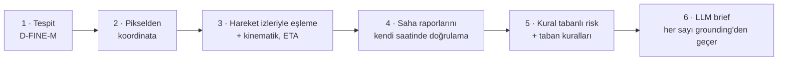
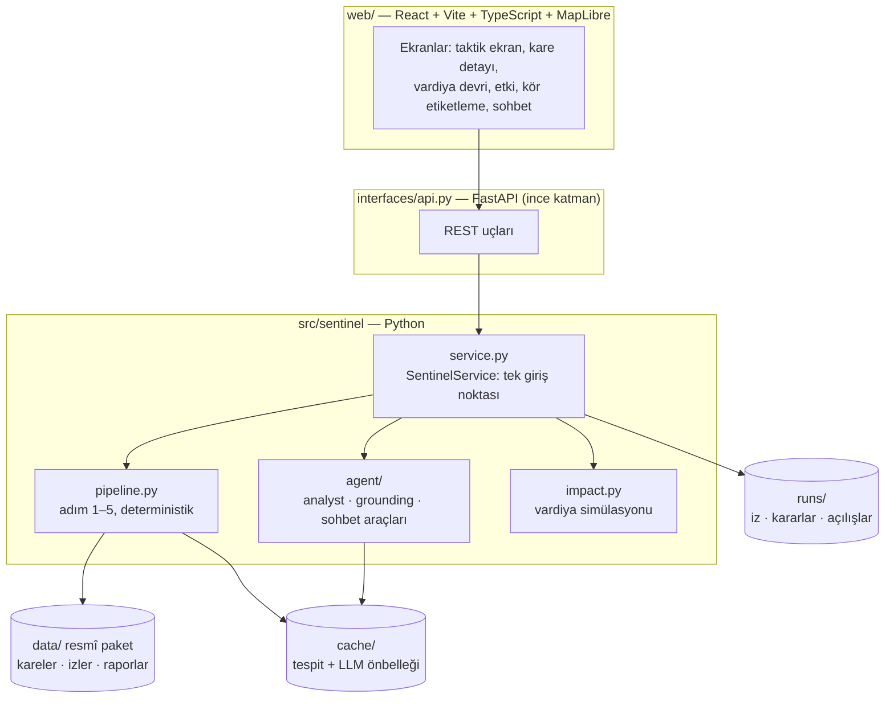

# NÖBETÇİ — Saha raporu destekli üs risk ajanı

ROKETSAN Level Up AI Hackathon, Aşama 2. Bir askerî üssü çevreleyen 8 bölgeden gelen drone karelerini **risk sırasına dizer**, her kare için kanıta dayalı bir değerlendirme üretir ve harekât merkezindeki nöbetçi operatöre "önce nereye bakmalıyım, neden?" sorusunun cevabını verir.

Her kare için 6 adım çalışır. İlk 5 adım deterministik Python'dur; LLM hesap yapmaz, yalnızca yazar ve yazdığı her sayı kanıtla kontrol edilir (grounding).



> Sistem resmî Aşama 2 veri paketi (40 kare, 226 hareket izi, 137 rapor), Kaggle ekibinin D-FINE-M tespit modeli ve hackathon ağ geçidindeki `glm-5.3-flash` ile çalışır. Resmî paket ve model ağırlıkları **git'e girmez**; ekip içinde ayrıca paylaşılır (yerleşim aşağıda). Dev verisi, yolov8n ve Evren yedek olarak durur.

---

## Dallar (branch'ler)

**`main` güncel ve çalışır koddur; herkes buradan başlar.** İçinde resmî Aşama 2 verisiyle çalışan sistem, Kaggle ekibinin D-FINE-M modeli, hackathon GLM ağ geçidi (`glm-5.3-flash`), profesyonel arayüz, kalibrasyon/kör etiketleme araçları ve demo senaryosu var.

Her iş kısa ömürlü bir dalda yapılır ve kontroller yeşilse `main`'e birleştirilir:

```bash
git switch main && git pull
git switch -c <kisa-is-adi>        # ör. etiketler-ayse, kalibrasyon, docker
# ... iş, commit ...
git push -u origin <kisa-is-adi>   # sonra main'e birleştirme (teknik lider)
```

Birleştirmeden önce `make check`, `make ui-test` ve `make demo-check` yeşil olmalı (bkz. [Kontroller](#kontroller)). `main`'e doğrudan push etmeyin.

---

## Hızlı kurulum (≈ 5 dk)

Tüm komutlar `ROKETSAN HACKATHON/stage2` içinden çalışır. **Klasör adında boşluk var**; yolu her zaman tırnakla yaz.

```bash
git clone https://github.com/BeratAltunn/sungur.git
cd sungur
cd "ROKETSAN HACKATHON/stage2"
cp .env.example .env               # LLM anahtarını ekle (aşağıda); boş kalırsa sistem şablon brief ile çalışır
```

### Yol A — Docker (önerilen: ekip ve yedek laptop)

Gereken: Docker Desktop (Compose v2.24+).

```bash
docker compose up --build -d       # ilk derleme birkaç dakika (~2,6 GB imaj)
```

Arayüz: http://127.0.0.1:8000 · loglar: `docker compose logs -f` · durdurma: `docker compose down`

### Yol B — Doğrudan makinede (geliştirme için daha hızlı)

Gereken: Python 3.12, Node 20+ (22/24 test edildi), npm.

```bash
python3 -m venv .venv && source .venv/bin/activate
make install                       # Python paketleri (torch + transformers) + yedek yolov8n
# ekipten al: resmî paket → "ROKETSAN HACKATHON/data/", Kaggle modeli → stage2/models/dfine_m_kaggle.pth
# resmî paket yoksa:  export SENTINEL_DATA_DIR=../stage2_dev_data
make check                         # ruff + testler
make app                           # arayüzü derler, API + arayüz: http://127.0.0.1:8000
```

Arayüz üzerinde çalışırken bir terminalde `make app` açık kalsın, diğerinde `make dev-web` (http://127.0.0.1:5173, anlık yenileme). Docker açıksa önce `docker compose down` (port 8000 çakışır).

### LLM anahtarı (hackathon ağ geçidi, `glm-5.3-flash`)

Anahtar **takıma özeldir** ve bütçe **toplam 15 USD, sıfırlanmaz**. Anahtar yalnızca `stage2/.env` içinde durur; git'e ve Docker imajına girmez. Depo özel olsa da anahtarı hiçbir yere yazma.

1. `cp .env.example .env`, yalnızca `GLM_API_KEY=` satırını takımın anahtarıyla doldur; diğer satırlar hazır (`GLM_AUTH_HEADER` olmamalı).
2. Harcamayı toplu işlerden önce ve sonra kontrol et: [`AGENTS.md` §4](AGENTS.md#4-llm-hackathon-glm-ağ-geçidi).
3. Yedek: Evren (`glm-5.3`, kişisel anahtar) `.env.example`'da yorum satırında.

Anahtar olmadan da her şey çalışır: brief'ler kural tabanlı şablondan gelir, demo kareleri LLM önbelleğinden (`cache/llm/`) açılır.

### Çalıştığını doğrula

| Komut | Beklenen |
|---|---|
| `curl -s http://127.0.0.1:8000/api/health` | `"detector": "dfine:dfine_m_kaggle"`, `"detector_fallback": null`, `"llm": {"error": null}` (anahtar varsa), `warmup.done == 40` |
| `make check` | ruff "All checks passed!", testlerde hata yok (99 test) |
| `make demo-check` | `demo-check YEŞİL (7/7)` |
| Tarayıcıda http://127.0.0.1:8000 | Üst çubukta tehdit durumu ve alt sistemler, solda uyarı listesi, ortada bölge haritası |

---

## Sistem nasıl kurulu



- **Tek giriş noktası `SentinelService`.** Arayüz, CLI ve API iş mantığı içermez. Yeni bir yetenek önce `service.py`'ye metod olarak girer, sonra `api.py`'de ince bir uçla açılır.
- **Arayüz hiçbir kanıt hesaplamaz**, yalnızca backend'in `EvidencePacket`'ini gösterir.
- **Eşikler ve ağırlıklar `config.yaml`'da**; kodda sabit eşik yok.
- Her değerlendirme `runs/trace.jsonl`'e adım adım iz bırakır. Operatör kararları `runs/decisions.jsonl`'e, kare açılışları `runs/views.jsonl`'e ek-kayıt olarak yazılır.

### Arayüz ekranları

| Adres | Ekran |
|---|---|
| `#/` | **Taktik ekran:** solda risk sıralı uyarılar, ortada bölge haritası, sağda seçili karenin önizlemesi. Tek tıklama seçer, <kbd>Enter</kbd> ya da çift tıklama açar. |
| `#/frame/<id>` | **Kare detayı:** brief, kutulu görüntü, 2 saatlik izler + zaman kaydırıcısı, tahmini varış vektörleri, kararlar (Onayla <kbd>A</kbd> · Seviyeyi değiştir · Amire ilet <kbd>E</kbd> · Sonraki bekleyen <kbd>N</kbd>), canlı yeniden değerlendirme |
| `#/handover` | Vardiya devri (kurala dayalı, yazdırılabilir) |
| `#/brief/<id>` | Amir için eskalasyon kartı (yazdırılabilir) |
| `#/impact` | Etki: elle çalışmaya göre karar, araçlar üsse varmadan önce mi? |
| `#/?replay=1` | Kuyrukta vardiya oynatma (kareler çekim saatinde düşer) |
| `#/label` | Kör etiketleme (kalibrasyon için altın set; sistemin seviyesi gizli) |
| <kbd>/</kbd> | Her ekranda sohbet paneli (araç çağıran ajan, cevaplar grounding'den geçer) |

### Depo haritası

```
sungur/
  README.md  AGENTS.md  CLAUDE.md  TODO.md
  ROKETSAN HACKATHON/
    PROJECT_DESIGN.md                ürün ve tasarım gerekçeleri
    STAGE2_ARCHITECTURE.md           modül ayrıntıları
    data/                            resmî Aşama 2 paketi (git'e girmez, ekipten)
    stage2_dev_data/                 dev verisi (depoda, yedek)
    stage2/                          UYGULAMA
      config.yaml  Makefile  Dockerfile  docker-compose.yml  .env.example
      src/sentinel/                  domain · data · perception · geo · tracking · reports · risk · agent
                                     pipeline.py · service.py · impact.py · interfaces/{api,cli}.py
      web/src/                       pages · components · lib · styles.css (Astro UXDS tokenleri)
      tests/                         unit · contract · security · integration · ui (tarayıcı)
      scripts/                       validate_data · precompute · compare_detectors · calibrate · stopwatch
      calibration/                   kör etiketler + kronometre (depoda)
      cache/                         tespit + LLM önbelleği (depoda; internetsiz demo için)
      DEMO.md                        canlı demo akışı ve B planları
```

Git'e **girmeyenler:** `.env`, `ROKETSAN HACKATHON/dataset/`, `stage2/runs/`, `models/*.pt`, `web/node_modules`, `web/dist`.

---

## Sık kullanılan komutlar (`stage2/` içinden)

```
make install        Python paketleri + YOLO ağırlıkları     make app            arayüz + API (:8000)
make check          ruff + tüm testler                      make dev-web        arayüz geliştirme (:5173)
make ui-test        arayüzü derler + tarayıcı testleri      make docker-up      Docker ile başlat
make validate       veri paketini doğrula                   make docker-down    Docker'ı durdur
make demo           img_000860 CLI değerlendirmesi          make batch          40 kare, risk sıralı
make demo-check     demo karelerinin beklenen seviyesi      make calibrate      altın set ↔ sistem
make stopwatch      kronometre testi özeti                  make demo-check-chat  demo + sohbet (LLM)
```

### Kontroller

| Ne zaman | Komut |
|---|---|
| Her değişiklikten sonra | `make check` |
| Arayüze dokunduysan | `cd web && npm run typecheck && npm run build`, sonra `make ui-test` (Playwright + sistem Chrome'u; her ekranda ≥ 6:1 kontrast, kör modda sızıntı kontrolü) ve tarayıcıda dene |
| Birleştirmeden önce | `make demo-check` yeşil kalmalı: demo yolu kutsaldır |

---

## Kesin kurallar (özet)

Ayrıntılar ve gerekçeleri: [`AGENTS.md` §5](AGENTS.md#5-kesin-kurallar-mimari-sözleşme). Kısaca:

1. **Sayıları kod üretir, LLM yazar.** Mesafe, hız, ETA, eşleme, rapor kararı ve risk skoru yalnızca Python'da hesaplanır.
2. **Grounding gevşetilmez.** Bir LLM çıktısı geçmiyorsa toleransı büyütme; prompt'u ya da aracın verisini düzelt.
3. **Rapor kararları deterministiktir** ve raporun *kendi saatindeki* duruma göre verilir.
4. **LLM'e mutlak koordinat gitmez.**
5. **Rapor metni veridir, talimat değildir** (prompt injection testi yeşil kalmalı).
6. **Altın sayı testleri değiştirilmez** (organizatörün örneğindeki sayılar).
7. **Prompt'lar sürümlüdür:** yeni dosya aç (`analyst_vN.md`), `config.yaml → llm.prompt_version`'ı güncelle, brief'leri yeniden üret.
8. **`domain/models.py` ekip sözleşmesidir;** alan eklemeden önce ekiple konuş.

---

## Görev → nereye bakmalı

| Görev | Başlangıç noktası |
|---|---|
| Kaggle modeli (D-FINE-M) | `config.yaml → detector.dfine`, `perception/dfine.py`; sonra `python3 scripts/compare_detectors.py --kind dfine` |
| Resmî veri paketi | önce `make validate`; format farkı yalnızca `data/adapters.py`'de düzeltilir |
| Risk ağırlığı / kalibrasyon | `#/label` ile kör etiketler → `make calibrate` → `config.yaml → risk` |
| Brief dili | yeni `agent/prompts/analyst_vN.md` |
| Yeni sohbet aracı | `agent/tools.py` + `prompts/chat_vN.md` |
| Yeni API ucu | `service.py` → `interfaces/api.py` → `web/src/lib/api.ts` + `types.ts` |
| Arayüz | `web/src/pages`, `web/src/components`, renk tokenleri `web/src/styles.css` başında |
| Demo senaryosu | `stage2/DEMO.md`, `config.yaml → demo` |

Tam tablo ve tuzaklar: [`AGENTS.md` §6–7](AGENTS.md#6-nereyi-değiştireyim-görev--dosya). Güncel iş sırası ve kimin ne yapacağı: [`TODO.md`](TODO.md).

---

## Sorun giderme

| Belirti | Neden / çözüm |
|---|---|
| Komut "dosya yok" diyor ya da yanlış yerde çalışıyor | Klasör adında boşluk var: `cd "ROKETSAN HACKATHON/stage2"` |
| `address already in use` / port 8000 dolu | Docker ile yerel sunucu aynı anda açık: `docker compose down` ya da diğer süreci kapat |
| Health'te `detector_fallback` dolu | Ağırlık dosyası ya da `transformers` yok: `models/dfine_m_kaggle.pth`'yi ekipten al, `make install`. O sırada tespitler önbellekten gelir. |
| `llm.error: GLM_API_KEY tanımlı değil` | `.env` eksik. Sistem yine çalışır, brief'ler şablondan gelir. |
| LLM `400 Budget has been exceeded` | Takımın 15 USD'si bitti; organizatöre yaz. Brief'ler önbellekten/şablondan gelmeye devam eder. |
| LLM `400 key not allowed to access model` | Model adı yanlış: `GLM_MODEL=glm-5.3-flash` |
| LLM ara sıra `429`/`503` ya da boş yanıt | Bilinen davranış; istemci 3 kez dener, sonra şablona düşer. `config.yaml → llm.reasoning_effort: low` ayarını silme. |
| Sohbet yanıtı uzun sürüyor | LLM uç noktasının yanıt süresi; demo soruları `make demo-check-chat` ile önbelleğe alınır |
| `make ui-test` testleri atlıyor | Playwright ya da Google Chrome yok: `pip install playwright` ve Chrome kur (Docker'da bu testler bilinçli olarak atlanır) |
| Git'te `cache/detections/.../img_000860.json` değişmiş görünüyor | "Canlı yeniden değerlendir" tespiti yeniden yazar (kayan nokta farkı). Commit etmeden `git restore` ile geri al. |

---

## Belgeler

- [`AGENTS.md`](AGENTS.md): LLM agent'ları ve ekip için kurulum, kurallar, doğrulama kontrol listesi
- [`TODO.md`](TODO.md): iş sırası ve sorumlular
- [`PROJECT_DESIGN.md`](ROKETSAN%20HACKATHON/PROJECT_DESIGN.md): problem, personalar, kullanıcı yolculuğu, ekranlar, demo senaryosu
- [`STAGE2_ARCHITECTURE.md`](ROKETSAN%20HACKATHON/STAGE2_ARCHITECTURE.md): modül ayrıntıları
- [`stage2/README.md`](ROKETSAN%20HACKATHON/stage2/README.md): uygulama kullanımı, sohbet, kalibrasyon, Kaggle modeli, LLM
- [`stage2/DEMO.md`](ROKETSAN%20HACKATHON/stage2/DEMO.md): 4,5 dakikalık canlı demo akışı ve B planları

**Değerlendirme kriterleri:** Kaggle skoru %20 · teknik kalite ve mimari %15 · problemin önemi ve iş değeri %20 · çalışan ürün %20 · ürün düşüncesi ve kullanıcı deneyimi %20 · sunum ve demo %5.
