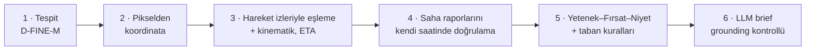

# DİZDAR — Saha Raporu Destekli Üs Risk Ajanı

**ROKETSAN Level Up AI Hackathon · Aşama 2**

Bir askerî üssün harekât merkezinde nöbetçi operatöre dakikalar içinde onlarca drone karesi, hareket kaydı ve saha raporu gelir. Raporların bir kısmı yanlış, bir kısmı kasıtlı olarak yanıltıcıdır. Her kareyi elle incelemek, gelen bilgiye yetişmez.

DİZDAR kareleri **geliş sırasıyla değil risk sırasıyla** dizer ve her kare için "neden bu kare, neden şimdi?" sorusunu kanıta bağlı olarak cevaplar:

- aracı tespit eder, haritaya yerleştirir, 2 saatlik hareket iziyle eşler ve üsse ne zaman varacağını hesaplar;
- saha raporlarını **raporun kendi saatindeki** duruma göre doğrular: "olağan" denen bir raporun o saatte o noktada kimse olmadığını gösterebilir;
- tehdidi **Yetenek–Fırsat–Niyet** modeliyle değerlendirir, seviyeyi açıklanabilir bir matrisle verir;
- LLM'e yalnızca Türkçe brief yazdırır; brief'teki her sayı, saat ve kimlik kanıtla karşılaştırılır (grounding).

Karar her zaman operatördedir; sistem hiçbir eylemi kendisi yapmaz.

> Sistem resmî Aşama 2 veri paketi (40 kare, 226 hareket izi, 137 saha raporu), takımın Aşama 1'de eğittiği **D-FINE-M** tespit modeli ve hackathon ağ geçidindeki **`glm-5.3-flash`** ile çalışır. LLM erişilemezse kural tabanlı şablon brief'e düşer; ürün çalışmaya devam eder.

---

## Tek bakışta

| | |
|---|---|
| Kare başına işlem | tespitten riske 6 adım; canlı yeniden değerlendirme ~2,3 sn (Mac M1, D-FINE MPS), önbellekten anında |
| Tespit (D-FINE-M, resmî veri) | karede olan 206 hareket izinin 206'sı tespit edildi; tespit ↔ iz eşleme mesafesi medyan 0,17 m (p90 0,74 m) |
| Seviye dağılımı (40 kare) | KRİTİK 4 · YÜKSEK 6 · ORTA 14 · DÜŞÜK 16 |
| Rapor doğrulama | 137 raporun her biri kendi saatinde; ÇELİŞİYOR için pozitif karşı-kanıt şartı |
| LLM brief | 40 karenin 40'ı LLM'den, hepsi grounding kontrolünden geçti; LLM'siz şablon brief yedekte |
| Testler | 155 test (29'u tarayıcı testi: demo yolu, klavyeyle kullanım, her ekranda ≥ 6:1 metin kontrastı) |

---

## Nasıl çalışır



| Adım | Ne yapar | Kod |
|---|---|---|
| 1 · Tespit | D-FINE-M (Aşama 1 modeli) araçları bulur: otomobil, kamyon, panelvan, otobüs. Güveni 0,4'ün altındaki kutular silinmez, "düşük güven" katmanına düşer ve bir hareket iziyle eşleşirse terfi eder. | `perception/` |
| 2 · Koordinat | Kutu merkezi karenin 4 köşe koordinatından bilineer olarak enlem/boylama çevrilir; üsse mesafe, yön ve bölge hesaplanır. | `geo/` |
| 3 · Eşleme + kinematik | Çekim anında karenin içindeki izler tespitlere Macar algoritmasıyla eşlenir (tuzak izler kare dışında kaldığı için hiç eşlenmez). Son 2 saatten yaklaşma hızı, yöne hizalanma, duraklamalar ve ETA çıkar. | `tracking/` |
| 4 · Rapor doğrulama | Rapor metni kurallarla yapılandırılmış iddiaya çevrilir (konum, araç tipi, sayı, dost kimliği, "üsse ilerliyor", "hareketsiz"…) ve **raporun saatindeki** iz durumuyla karşılaştırılır. | `reports/` |
| 5 · Risk | Her araç için Yetenek–Fırsat–Niyet bantları, seviye matrisi ve taban kuralları; ETA ayrı aciliyet ekseni. | `risk/` |
| 6 · Brief | LLM maskelenmiş kanıt paketinden Türkçe brief yazar; grounding her sayıyı kontrol eder, tutmazsa bir düzeltme turu, yine tutmazsa şablon. | `agent/` |

### Rapor doğrulama ilkeleri

- **Zaman:** Rapor, çekim anına göre değil kendi saatindeki duruma göre doğrulanır. Organizatörün örneğinde 12:35 raporu yalnız konuma bakılsa "uyumlu" çıkar; oysa o saatte noktada kimse yoktur ve şimdi üsse yaklaşan kamyon 5,6 km uzaktadır → ÇELİŞİYOR.
- **Kanıt yokluğu çelişki değildir:** ÇELİŞİYOR için pozitif karşı-kanıt gerekir. Noktada kimse yoksa, raporun öznesi olabilecek bir aracın (bu karede görülen, noktaya rapordan sonra varan, tipi ve davranışı dışlanmayan) o saatte başka yerde olduğu gösterilmelidir; yoksa karar DOĞRULANAMAZ.
- **Kanıt yokluğu doğrulama da değildir:** Rapor "kamyon" diyor ve noktadaki aracın tipi teyit edilemiyorsa DOĞRULANDI değil DOĞRULANAMAZ.
- **Tip bilgisi dürüst:** Güveni 0,4'ün altındaki kutunun sınıfı "bilinmiyor" sayılır; sınıf bilgisi yalnızca o karedeki ve daha önce çekilmiş karelerdeki emin tespitlerden gelir (gelecek kare kullanılmaz).
- **Kaynak güveni önsel değildir:** Resmî rapor da çürütülebilir; kanıtla çelişen bir dost kimliği iddiası riski düşürmez, **aldatma göstergesi** olarak artırır.

### Risk modeli: Yetenek–Fırsat–Niyet

Tehdit üçgeni: bir tehdidin gerçekleşmesi için üç unsurun birlikte bulunması gerekir. Her araç için üç kenar 0–100 puanlanır ve DÜŞÜK / ORTA / YÜKSEK banda çevrilir.

| Kenar | Soru | Girdiler |
|---|---|---|
| **Yetenek** | ne? | araç sınıfı (kamyon/otobüs > panelvan > otomobil; teyitsiz sınıf "bilinmiyor"), konvoy (≥ 3 araç birlikte yaklaşıyorsa grup olarak) |
| **Fırsat** | nerede? | üsse mesafe (< 2 km YÜKSEK, 2–3,5 km ORTA) |
| **Niyet göstergeleri** | ne yapıyor? | üsse yaklaşma, kanıtla çelişen kimlik iddiası (aldatma), hareket kaydı olmaması; uzaklaşma ve teyitli dost kimliği düşürür. Gösterge yoksa niyet bilinmiyor (DÜŞÜK). |

Seviye matrisi (tüm kurallar `risk/scoring.py`, eşikler `config.yaml → risk`):

| Bantlar | Seviye |
|---|---|
| üçü de YÜKSEK | KRİTİK |
| iki YÜKSEK + bir ORTA | YÜKSEK |
| hiçbiri DÜŞÜK değil | ORTA |
| bir kenar DÜŞÜK (bir unsur eksik: tehdit gerçekleşemez) | en fazla ORTA |
| iki+ kenar DÜŞÜK | DÜŞÜK |

**Taban kuralları** matrisin üstüne gelir; brief (LLM) seviyeyi bu tabanların altına indiremez:

- **KRİTİK (aciliyet):** üsse yaklaşıyor, ETA < 10 dk ve teyitli ağır araç ya da niyet göstergeleri YÜKSEK. ETA bir kenar değil, **aciliyet ekseni**dir.
- **YÜKSEK:** üsse yakın aldatma (niyet + fırsat YÜKSEK) · potansiyel tehdit (yetenek + fırsat YÜKSEK, aklayıcı kanıt yoksa; "niyet bilinmiyor" "niyet yok" demek değildir) · üsse < 2 km'de emin tespit edilmiş kayıtsız araç.

Kuyruk sırası: seviye → tabandan önceki matris seviyesi (üçgeni tam olan önce) → en kısa ETA → sıralama skoru (üç kenarın geometrik ortalaması). Her faktör hangi kenara ne kadar katkı verdiğiyle birlikte arayüzde görünür; gizli skor yoktur.

*Not:* Bu veride neredeyse her araç bekle-ilerle hareket ettiği için duraklamalar skora girmez, yalnızca bağlam olarak gösterilir. Altın set / kalibrasyon yapılmadı (takım kararı); eşikler dağılıma ve demo karelerine bakılarak seçildi.

### LLM, grounding ve güvenlik

- **Sayıları kod üretir, LLM yazar.** Mesafe, hız, ETA, eşleme, rapor kararı ve risk yalnızca Python'da hesaplanır.
- **Grounding** (`agent/grounding.py`): brief ve sohbet cevaplarındaki her sayı, saat ve kimlik kanıt paketiyle karşılaştırılır; rapor kararı değiştirilemez; seviye kural seviyesinden en fazla 1 kademe sapabilir ve tabanın altına inemez.
- **Veri en aza indirilir:** LLM'e görüntü ve mutlak koordinat gitmez; konumlar üsse mesafe/yön/bölge olarak verilir.
- **Rapor metni veridir, talimat değildir:** metinler `<rapor>` etiketiyle işaretlenir; prompt injection testi (`tests/security/`) bunu korur.
- **Sohbet:** LLM salt-okur araçlar çağırır (`list_frames`, `analyze_image`, `get_track`, `find_reports`, `zone_summary`); sayımları araçlar verir, LLM saymaz. Operatör anormal bir aracı sohbete sürükleyebilir; sistem duruma göre soru önerir.
- **Önbellek ve bütçe:** yanıtlar `dizdar/cache/llm/`'de (anahtar: model + prompt sürümü + ayarlar + mesajlar); 40 brief ve demo soruları hazır, demo internetsiz de açılır. Bütçe bekçisi harcamayı sınırlar.

---

## Arayüz

React + TypeScript + MapLibre; FastAPI ile tek süreçte sunulur (`http://127.0.0.1:8000`), internet gerekmez. Görsel dil Astro UXDS koyu teması; tüm metinler ≥ 6:1 kontrastlı.

| Adres | Ekran |
|---|---|
| `#/` | **Ana harita:** 3B arazi üzerinde günün tüm araçları, zaman çubuğuyla oynatılır (renk = o anki tehdit seviyesi). Solda risk sıralı **aktif uyarılar**, üstte tesis tehdit durumu. Karta tıklayınca kare özeti (ETA, hareket, sınıflar, çelişen raporlar, anormal araçlar) açılır. |
| `#/frame/<id>` | **Kare detayı:** brief (seviye, manşet, önerilen eylem, tehdit profili, kanıt çipleri, grounding rozeti), kutulu görüntü, 2 saatlik izlerle 3B harita ve zaman kaydırıcısı (rapor işaretine tıklayınca harita raporun saatine gider), sekmeler (*Neden?* · *Raporlar* · *Araçlar* · *Ajan izi*), **canlı yeniden değerlendir** ve kararlar: Onayla <kbd>A</kbd> · Seviyeyi değiştir (gerekçe zorunlu) · Amire ilet <kbd>E</kbd> · Sonraki bekleyen <kbd>N</kbd> |
| <kbd>/</kbd> | **Sohbet paneli** (her ekranda): duruma göre hazır sorular, araç sürükle-bırak, tıklanabilir kanıt kimlikleri |
| `#/brief/<id>` | Amir için yazdırılabilir eskalasyon kartı |
| `#/handover` | Vardiya devri (kurala dayalı, LLM'siz, yazdırılabilir) |
| `#/impact` | Etki simülasyonu: elle incelemeye göre kararlar araçlar üsse varmadan önce mi? (kare başına süreler varsayımdır) |
| `#/label` | Kör etiketleme aracı (sistemin seviyesi gizli; kalibrasyon için) |

Canlı demo akışı ve B planları: [`dizdar/DEMO.md`](dizdar/DEMO.md).

---

## Kurulum

Tüm komutlar `asama-2/dizdar` içinden çalışır.

**Git'te olmayan, ayrıca sağlanan dosyalar:**

| Dosya | Yeri | Yoksa |
|---|---|---|
| Resmî Aşama 2 veri paketi | `asama-2/data/` (`image_meta.json`, `tracks.csv`, `field_reports.json`, `zones.json`, `images/`) | **zorunlu:** veri paketi olmadan sistem açılmaz (başka bir yerdeyse `SENTINEL_DATA_DIR=/yol`) |
| D-FINE-M ağırlıkları | `asama-2/dizdar/models/dfine_m_kaggle.pth` (79 MB, yalnızca EMA ağırlıkları) | tespitler depodaki önbellekten gelir; "canlı yeniden değerlendir" çalışmaz |
| LLM anahtarı | `asama-2/dizdar/.env` (`cp .env.example .env`, `GLM_API_KEY=` doldurulur) | brief'ler önbellekten ya da şablondan gelir; sohbet kapalı |

### Docker (önerilen)

Gereken: Docker Desktop (Compose v2.24+).

```bash
cd asama-2/dizdar
cp .env.example .env
docker compose up --build -d        # ilk derleme birkaç dakika; arayüz: http://127.0.0.1:8000
docker compose run --rm --no-deps nobetci python -m pytest -q    # testler imajın içinde
```

Veri paketi ve ağırlıklar imaja girmez, salt okunur bağlanır; `.env` de imaja girmez. Docker'da Apple GPU yoktur, D-FINE CPU'da çalışır (tespitler önbellekte olduğu için fark edilmez).

### Doğrudan makinede

Gereken: Python 3.12, Node 20+, npm.

```bash
cd asama-2/dizdar
python3 -m venv .venv && source .venv/bin/activate
make install          # Python paketleri (torch + transformers)
cp .env.example .env
make terrain          # isteğe bağlı: 3B arazi karoları (~3 MB, açık kaynak: AWS Terrain Tiles + Sentinel-2)
make check            # ruff + tüm testler
make app              # arayüzü derler, API + arayüz: http://127.0.0.1:8000
```

### Çalıştığını doğrula

| Komut | Beklenen |
|---|---|
| `make validate` | `SONUÇ: temiz` — 40 kare, 226 iz, 137 rapor, 20 tuzak iz |
| `make check` | `All checks passed!`, testlerde hata yok |
| `make demo-check` | `demo-check YEŞİL (7/7)`: img_000860 KRİTİK, R119/R125 ✗ ÇELİŞİYOR, img_001733 DÜŞÜK, brief'ler önbellekte |
| `curl -s http://127.0.0.1:8000/api/health` | `"detector": "dfine:dfine_m_kaggle"`, `"detector_fallback": null`, `warmup.done == 40` |

### Komutlar

```
make app            arayüz + API (:8000)             make demo           img_000860 CLI değerlendirmesi
make check          ruff + testler                   make batch          40 kare, risk sıralı kuyruk
make ui-test        arayüzü derler + tarayıcı testi  make demo-check     demo karelerinin beklenen sonucu
make validate       veri paketini doğrular           make demo-check-chat  demo + sohbet soruları (LLM)
make precompute     40 kare için tespit + brief önbelleği
make docker-up / docker-down / docker-test
python3 -m sentinel evaluate img_000860 [--json] [--no-llm] [--live]
python3 -m sentinel reports --zone "Dogu Yolu"       raporların zaman-duyarlı doğrulaması
```

---

## Klasör yapısı

```
asama-2/
  README.md                 bu belge
  PROJECT_DESIGN.md         problem, personalar, kullanıcı yolculuğu, ekranlar, tasarım kararları
  STAGE2_ARCHITECTURE.md    modül ayrıntıları
  data/                     resmî veri paketi (git'e girmez, ayrıca sağlanır)
  dizdar/                   uygulama
    config.yaml             tüm eşikler, ağırlıklar, model ve LLM ayarları
    src/sentinel/
      domain/models.py      pydantic modeller (katmanlar arası sözleşme)
      data/                 dosya okuma + Repository (zaman ızgarası, uzay-zaman sorguları)
      perception/           D-FINE-M · yedek ultralytics · önbellek · test (oracle)
      geo/ tracking/ reports/ risk/     adım 2–5
      agent/                LLM istemcisi, analist, grounding, şablon brief, sohbet araçları, prompts/
      pipeline.py           evaluate(image_id) → EvidencePacket (adım 1–5, LLM'siz)
      service.py            SentinelService: arayüz, CLI ve API'nin tek giriş noktası
      interfaces/           FastAPI (api.py) + CLI (cli.py)
    web/src/                ekranlar · bileşenler · harita · stiller
    tests/                  unit · contract · security · integration · ui (tarayıcı)
    scripts/                validate_data · precompute · compare_detectors · build_terrain · calibrate · stopwatch
    cache/                  tespit + LLM önbelleği (internetsiz ve LLM'siz demo için)
    DEMO.md                 canlı demo akışı ve B planları
```

Mimari kurallar: arayüz hiçbir kanıt hesaplamaz, yalnızca `EvidencePacket`'i gösterir · yeni bir yetenek önce `service.py`'ye, sonra ince bir API ucuna girer · eşikler kodda değil `config.yaml`'dadır · prompt'lar sürümlüdür (`analyst_v4`, `chat_v3`). Ayrıntılı kurallar: kökteki [`AGENTS.md`](../AGENTS.md).

---

## Tespit modeli: D-FINE-M (Aşama 1)

Takımın Aşama 1 kontrol noktası (AP50 0,712) `kind: dfine` ile çalışır (`perception/dfine.py`):

- Orijinal D-FINE/DEIM anahtarları transformers'ın `DFineForObjectDetection` düzenine çevrilir; yükleme strict'tir. EMA ağırlıkları kullanılır.
- Ön işleme eğitimle birebir: RGB, `cv2.resize` ile 1408×800'e düz gerdirme (letterbox yok), yalnızca /255. Sınıf sırası `[car, truck, van, bus]`.
- Cihaz MPS → CUDA → CPU; Mac M1'de ~0,3 sn/kare.
- Yeni bir modelin kabulü: `python3 scripts/compare_detectors.py --kind dfine` (izleri referans alan yaklaşık recall, eşleme mesafeleri, izsiz tespitler, değişen seviyeler).

Model yüklenemezse sistem aynı ayarlarla üretilmiş tespit önbelleğinden devam eder ve bunu belirsizlik olarak yazar.

---

## Bilinen sınırlamalar

- **Görüntü ölçeği köşe koordinatlarıyla uyuşmuyor** (eşleşen gerçek araç kutuları yerde medyan 10 m); bu yüzden metre cinsinden kutu boyutu filtresi kapalı. Konumlar izlerle 1 metrenin altında eşleştiği için risk etkilenmez.
- **D-FINE NMS'sizdir:** iç içe gerçek araçlar olduğu için sezgisel NMS eklenmedi; birkaç yinelenen kutu "kayıtsız araç" olarak kalabilir.
- **Sınıf güveni:** düşük güvenli tespitlerin sınıfı teyit edilmez; brief bunu "olası kamyon" diye yazar.
- **Kalibrasyon yok:** seviye eşikleri altın set yerine dağılım ve demo kareleriyle seçildi.
- **Etki ekranı bir modeldir:** kare başına elle / sistemle süreler varsayımdır (`config.yaml → impact`), ölçüm değildir.
- **Adlandırma:** arayüz DİZDAR adını kullanır; Python paketi (`sentinel`), CLI çıktısı ve LLM prompt'ları kod adı NÖBETÇİ'yi korur.

---

## Belgeler

- [`PROJECT_DESIGN.md`](PROJECT_DESIGN.md): problem, personalar, kullanıcı yolculuğu, ekranlar, demo senaryosu, tasarım kararları
- [`STAGE2_ARCHITECTURE.md`](STAGE2_ARCHITECTURE.md): modül ayrıntıları
- [`dizdar/DEMO.md`](dizdar/DEMO.md): canlı demo akışı ve B planları
- [`../AGENTS.md`](../AGENTS.md): geliştirici ve kod asistanı rehberi (kurulum, kesin kurallar, tuzaklar)
